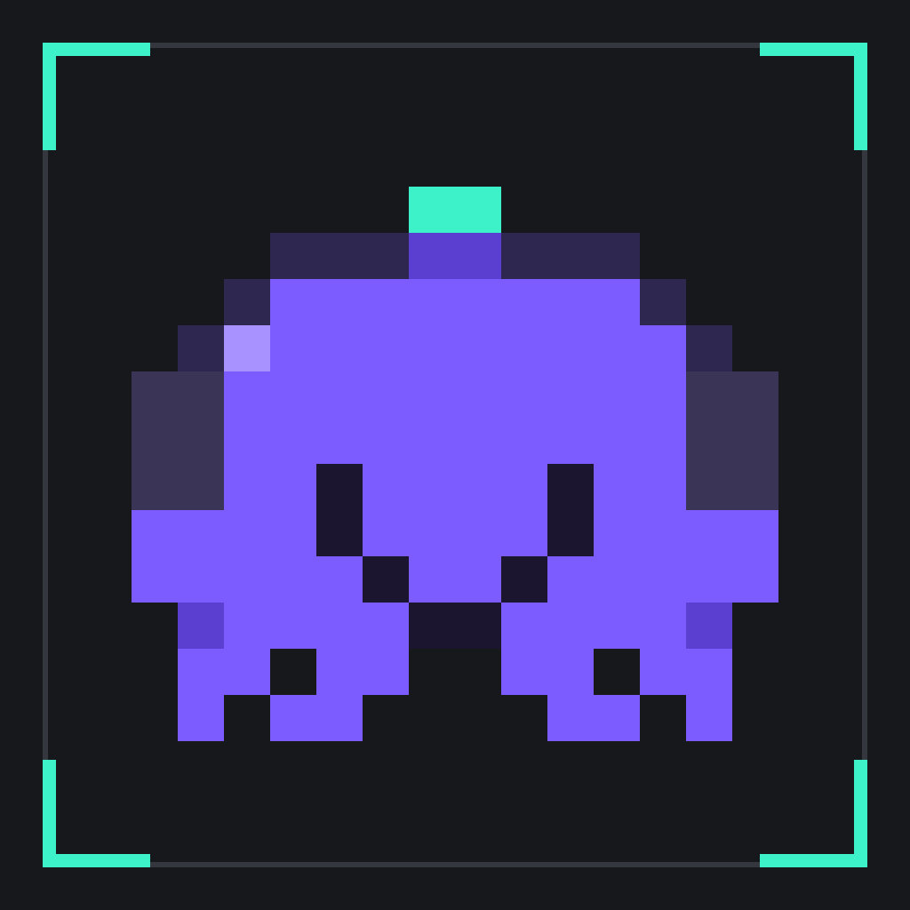
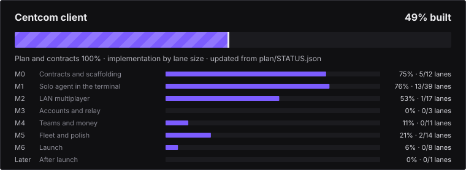
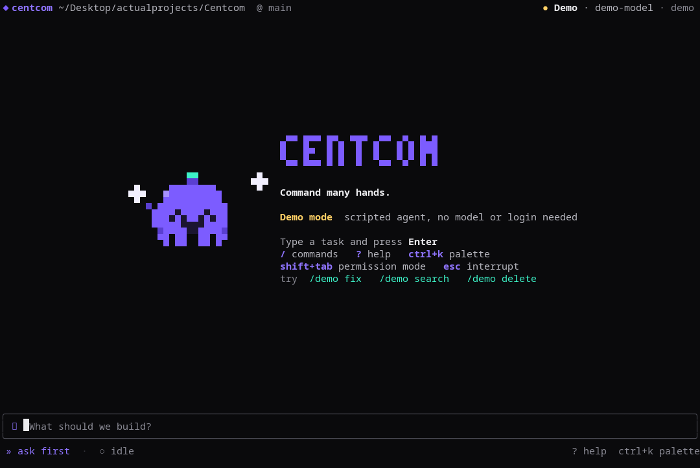
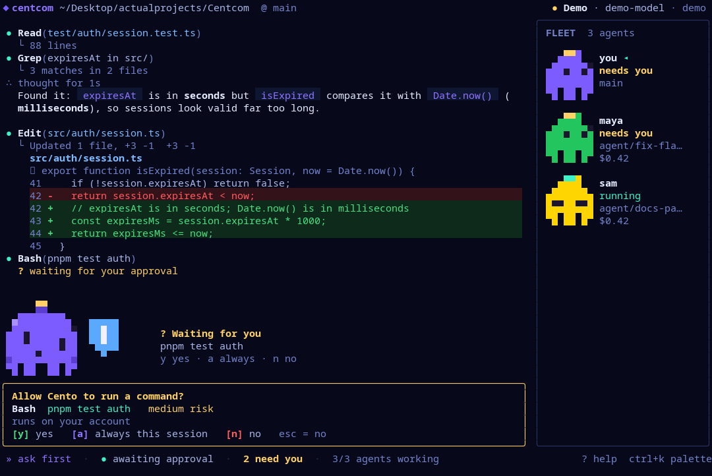

# Centcom

<p align="left"></p>

Command many hands. A terminal-first, multiplayer platform for running coding agents (it drives your own Claude Code and Codex CLIs; we never touch your login): several people and several agents in one workspace, over LAN or a hosted relay. Mascot: **Cento** the octopus.

> Status: **building.** The terminal app (with Cento), the Claude Code and Codex engines, real approvals, the local web app and auto skills work today. Multiplayer, accounts and the backend are still plans. See [Progress](#progress) and [`plan/`](plan/README.md).


<!-- progress:start -->

## Progress



**37% built** (weighted by lane size across 105 lanes). Details and how this is computed: [`tools/plan/progress.py`](tools/plan/progress.py). Update [`plan/STATUS.json`](plan/STATUS.json) when you finish or advance a lane, then run `python3 tools/plan/progress.py`.

## Next steps

1. **Smoke-test the Codex adapter on a real turn** — it passes its tests against Codex's published protocol schema and the real handshake, but no real model turn has run yet (C103); needs a Codex account
2. **C017 git worktree manager** — lets one session run parallel agents on separate branches; a solo feature that also unlocks the team fleet later
3. **Package the web launcher as a real desktop app** — "Start as app" opens a chromeless Chromium window today; a signed installable app (Electron or Tauri) is still to do
4. **Start multiplayer: C074 transport, C007 mock backend, then the M2 LAN lanes** — none of M2 exists yet; this is the product's main bet

### Started, not finished

| Lane | What | Done | Note |
|---|---|--:|---|
| [C013](plan/client/C013.md) | Agent runner daemon hosting AgentEngine processes (claude, codex) | 90% | runner, supervision, limits, restart, escalation, env allow-list, TrustStore, runnerd daemon over unix socket (auth, frame cap, lock, idle exit), FakeEngine, 1 MiB line cap in both engines. Not done: Windows named pipe; real Claude per-turn kill is a failed turn, not an agent crash |
| [C102](plan/client/C102.md) | Claude Code engine: drive the user’s own claude binary (stream-json, resume, approvals bridge) | 90% | claude stream-json, approvals bridge, resume token, interrupt; no version-range check |
| [C104](plan/client/C104.md) | Provider detection and login handoff: provider status, login, logout, doctor checks | 90% | provider detect (5 s probes, 15 s overall, 30 s cache), classify, redact, semver, login/logout handoff (inherit stdio, no shell, no TTY refusal), message table for all 9 codes, doctor checks, centcom provider status|login|logout|doctor. Not done: real login/logout tried against live vendor tools; supported ranges are placeholders; main help text |
| [C002](plan/client/C002.md) | CI pipeline: typecheck, lint, test, build matrix, contract-lock check | 90% | GitHub Actions runs typecheck, tests, web build, plan and contract lock, progress check; first run green; no build matrix or lint yet |
| [C007](plan/client/C007.md) | Mock backend: REST from OpenAPI plus WebSocket relay simulator | 90% | @centcom/testkit mock backend: all 93 REST operations (validated, schema-generated), device login/refresh rotation, pagination, idempotency, error injection, ws relay simulator, virtual clock, control plane, scenarios, CLI. Not covered: signature/encryption checks, stateful non-session resources |
| [C015](plan/client/C015.md) | Permission policy engine bridging engine approval requests | 85% | modes incl. dangerously-skip-permissions, session rules, real approval bridge; no persisted "always" rules |
| [C019](plan/client/C019.md) | Context visibility: usage display and compaction requests through the engine | 85% | context view: engine-reported usage only, warn/full thresholds with hysteresis, compaction request through the engine (capability, idle and approval checks, 60 s backoff), optional auto compaction, de-duplicating ledger, 1/s context events. Not yet: centcom context, /compact, meter UI, state machine mapping of context-full |
| [C026](plan/client/C026.md) | Local transcript persistence and engine session resume | 85% | conversations saved and resumed (-c, --resume, /resume, /new, web launcher and palette), verified with real Claude; Codex resume untested |

+19 more in [`plan/STATUS.json`](plan/STATUS.json).

### Ready to pick up (all dependencies done)

| Lane | What | Size | Milestone |
|---|---|---|---|
| [C010](plan/client/C010.md) | Opt-in telemetry client | S | M0 |
| [C043](plan/client/C043.md) | Task list and progress components | S | M1 |
| [C056](plan/client/C056.md) | End-to-end crypto module: keys, frames, grants, rotation | L | M2 |
| [C071](plan/client/C071.md) | LAN discovery over mDNS | M | M2 |

Each lane card lists its goal, contracts, acceptance criteria and tests. Read [`plan/START_HERE.md`](plan/START_HERE.md) first.

<!-- progress:end -->

## What is in this repo

| Path | What |
|---|---|
| [`plan/`](plan/START_HERE.md) | The build plan (start with `plan/START_HERE.md` and `plan/ROADMAP.md`): 101 backend lanes + 105 client lanes, architecture, strict guidelines, integration gates |
| [`contracts/`](contracts/README.md) | Frozen connection points shared with the backend repo (REST, WebSocket, events, crypto, LAN, billing) |
| [`assets/DESIGN.md`](assets/DESIGN.md) | Design system: brand, mascot, colour, type, motion, components, voice, accessibility |
| [`assets/theme/`](assets/theme) | Graphite/Paper theme: tokens, CSS, Tailwind preset, terminal themes, live preview |
| [`assets/mascot/`](assets/mascot) | Cento: 319 animations, 5 colours, crowds, gallery, terminal player |
| [`assets/The-Lines.txt`](assets/The-Lines.txt) | 743 spinner lines |
| `tools/plan/` | Plan, contract and lock tooling |

The server lives in the private repo `Caffeine-Driven-LLC/Centcom-backend`; both repos carry identical `contracts/`, `plan/` and `tools/plan/`.

## Run the terminal app

```sh
pnpm install
pnpm dev                 # scripted demo agent, no login needed
pnpm centcom             # drives your own Claude Code (must be installed and signed in)
```

Approvals work with real Claude Code: Centcom runs `claude` with `--permission-mode manual` and a tiny MCP tool (`--permission-prompt-tool`) that asks the app over a private local socket, so the dialog with the diff appears for every Write/Edit/Bash that needs one. If the app is unreachable the answer is always deny.

Try `/demo fix`, `/demo search` and `/demo delete` in demo mode (add `--demo-team` to preview teammates), `ctrl+k` for the palette, `/cento` for the 319-animation gallery, `?` for keys.
Flags: `--mode plan|acceptEdits`, `--mascot large|small|off`, `--cento-color red|yellow|green|brown`, `--theme light`, `--colors 256|16|never`, `--no-motion`.




**Auto skills:** before each prompt Centcom matches your installed skills and commands (`~/.claude/skills`, plugins, `.claude/skills`, `.claude/commands`) against it locally, shows what it picked, and tells Claude to apply them. `/auto on|off`, `/skills [filter]`.

**centcom-master:** `pnpm skills:sync` fetches the curated catalog in `packages/skills/catalog.tsv` (245 rows from ~70 repos) into `~/.centcom/master`: text files only (scripts are left out), pinned to a commit, scanned for prompt-injection and obfuscation, and exposed as one router skill with an index. Per prompt the matcher injects only the best 1 to 3 (by file path), never the whole bundle. Trusted publishers are on by default; overlapping, hook-dependent and unknown-publisher skills are off. `/skills enable <id>` and `/skills disable <id>` change that.

`tools/dev/shot.py` runs the app in a pseudo-terminal and saves a screenshot (needs `pip install pyte pillow`). Checks: `pnpm typecheck && pnpm test`.

## Web UI and desktop app

```sh
pnpm web          # builds the client, starts http://127.0.0.1:58008 and opens the launcher
pnpm web:app      # same, but opens it as a chromeless app window
```

The launcher lets you pick a project folder, then **Start on web** (a browser tab) or **Start as app** (a window with no browser chrome, own profile). Both show the same workspace and share the same running agent. The server listens on 127.0.0.1 only, checks Host and Origin, and needs the token in `~/.centcom/token` (the first visit sets a cookie).

## Scripting and saved conversations

```sh
centcom -p "summarise this repo"                   # run once, print the answer, exit
cat error.log | centcom -p "what went wrong?"      # piped text is added to the prompt
centcom -p "..." --output-format json              # result, usage, cost, session id as one JSON object
centcom -c                                         # continue the last conversation in this folder
centcom --resume ses_...                           # continue a specific one (list them with /resume)
```

Conversations are saved to `~/.centcom/sessions` (private files) and resumed through the agent's own session, so it remembers what was said. `/new` starts fresh and keeps the old one. Print mode declines anything that needs an approval and says so (exit code 3); allow it with `--mode acceptEdits` or `--dangerously-skip-permissions`. Exit codes: 0 done, 1 error, 2 bad usage, 3 an action was declined. Turn saving off with `--no-save`.

## Remembered settings

Centcom remembers what you choose: theme, Cento's size and color, model, permission mode, auto skills, the side panel, your last agent and your prompt history (per project). Settings come from five layers (defaults, your user file, a project file, environment, flags); `/config` shows each value and where it came from. A project file can't change anything risky, credentials in config files are refused, and skip-permissions is never saved. Details: [`docs/configuration.md`](docs/configuration.md).

## Try the mascot

```bash
cd assets/mascot
python3 play.py --tour                 # every animation in your terminal (true-colour terminal)
python3 play.py typing --color red     # one animation, any of 5 colours
xdg-open gallery.html                  # browse, recolour, tile into crowds
```

All generated GIFs (5 colours + duo/trio/squad/group crowds) are committed under `assets/mascot/gif/`; regenerate with `python3 assets/mascot/build.py`.

## Check the plan and contracts

```bash
python3 tools/plan/validate_contracts.py
python3 tools/plan/validate_plan.py
python3 tools/plan/lock.py --check
```
