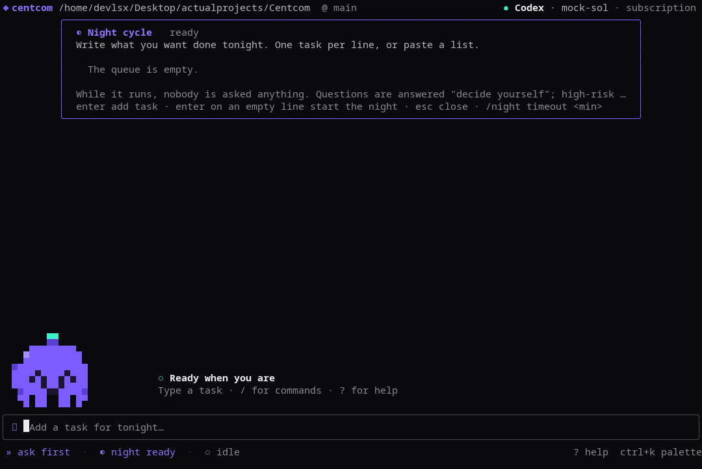
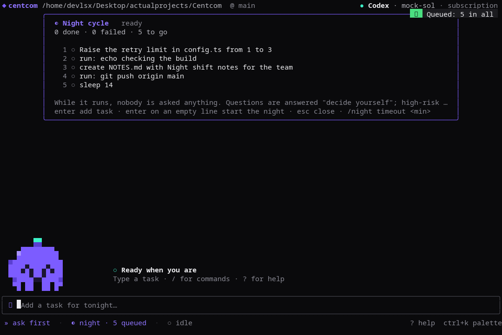
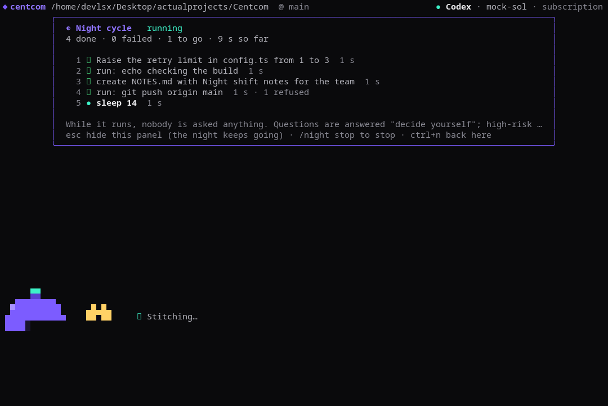
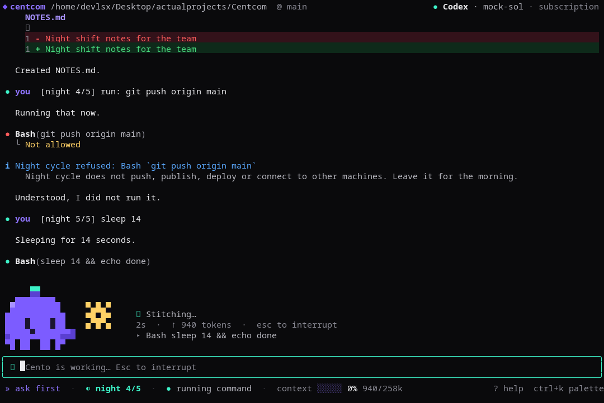
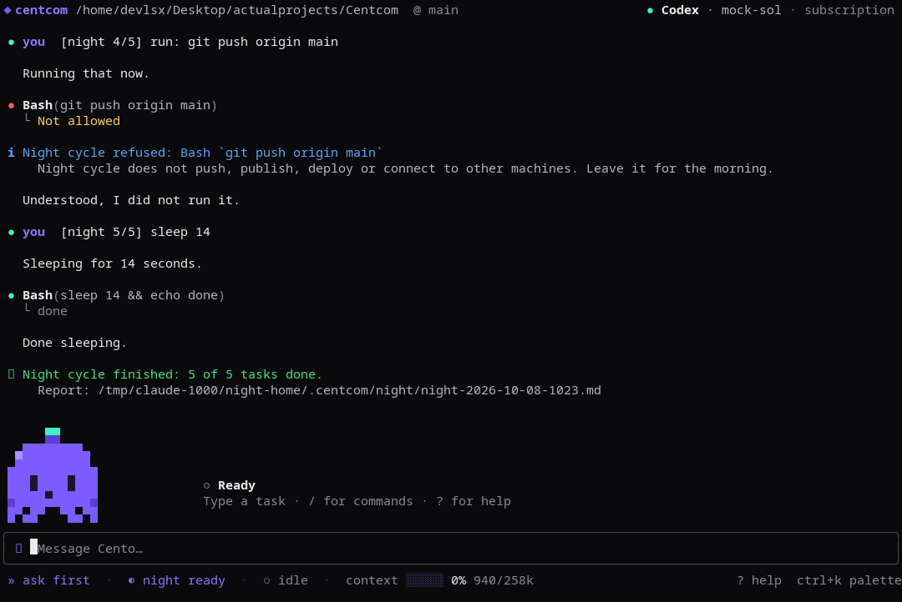

# Night cycle

Queue a lot of tasks, start the night, go to sleep. The agent works through them one at a time and nobody is asked anything until morning.

- **Open it**: `ctrl+n` or `/night`. Type one task per line (or paste a list; bullets and numbers are stripped; blank lines make each paragraph one task). **Enter on an empty line starts the night.** `esc` hides the panel; the night keeps going. The status line shows `◐ night 3/7`.
- **Commands**: `/night allow push` (let it push work branches and open pull requests; never `main`, never force, never merge or comment; remembered), `/night allow none`, `/night add <tasks>`, `/night list`, `/night remove <n>`, `/night clear`, `/night timeout <minutes>` (per task, default 60), `/night start`, `/night stop`, `/night off`, `/night report`.
- **What the agent is told** for each task: nobody will answer; do not ask questions; pick the most reasonable reading and list assumptions; finish end to end and run the project's checks; stay inside the project; end with a summary. The transcript shows `[night 3/7] <your task>`; the rules go to the agent only.
- **Approvals by rule while it runs** (hard blocks such as credentials, writes outside the project and `.git` still come first): questions are refused ("decide yourself"); high-risk actions are refused; anything that leaves the machine is refused (`git push`, `npm publish`, `gh pr merge`, `docker push`, `terraform apply`, `kubectl apply/delete`, `ssh`, `scp`, `curl … | sh`); everything else is allowed once. Each refusal is shown in the transcript and counted in the report.
- **When it stops**: queue empty; you stop it (the running task goes back in the queue); the usage limit is reached, the agent is signed out or not installed (the rest stays queued); or one task passes its time limit (it is interrupted and marked `timeout`, and the night continues). A failed task does not stop the night.
- **Morning**: a Markdown report is written to `~/.centcom/night/night-<date>-<time>.md` (status, time, allowed/refused actions and the agent's last message per task) and shown in the transcript. Tasks still queued are kept in `~/.centcom/night/queue.json` and come back next time you start Centcom.
- While the night runs, a normal message is refused with a hint (add it to the queue instead); slash commands still work.

Screens (the terminal here is 120×38; the check marks are missing in the screenshot font only):

| | |
|---|---|
|  |  |
|  |  |
|  | |

Building Centcom with Centcom: see [`dogfood.md`](dogfood.md).

Not covered: keeping the computer awake (use your OS's sleep settings or `caffeinate`/`systemd-inhibit`), working on a separate git branch (the agent is only told to commit locally in small steps), and the desktop app's Local agent screen (the terminal app has it first).
